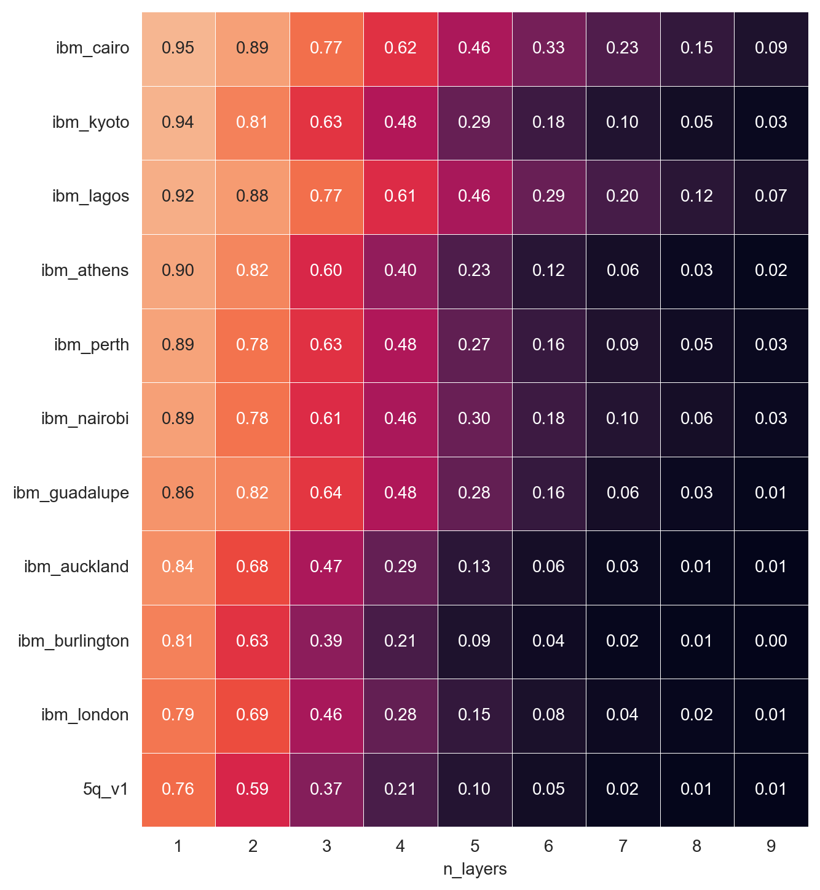
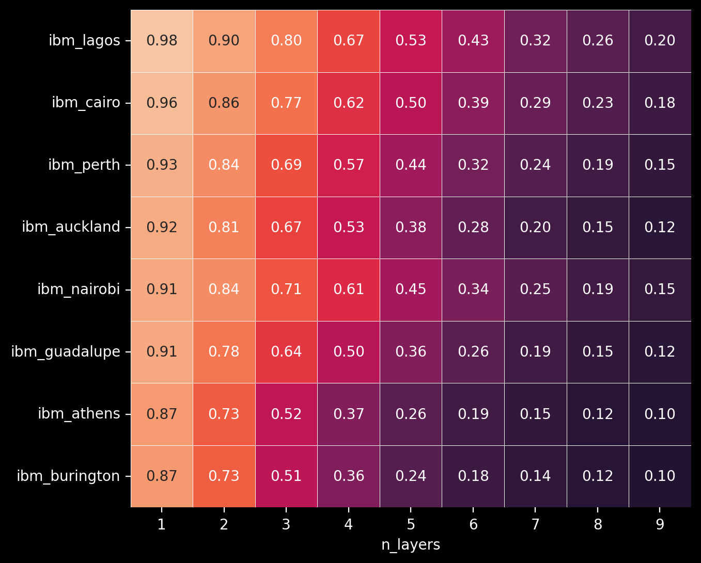
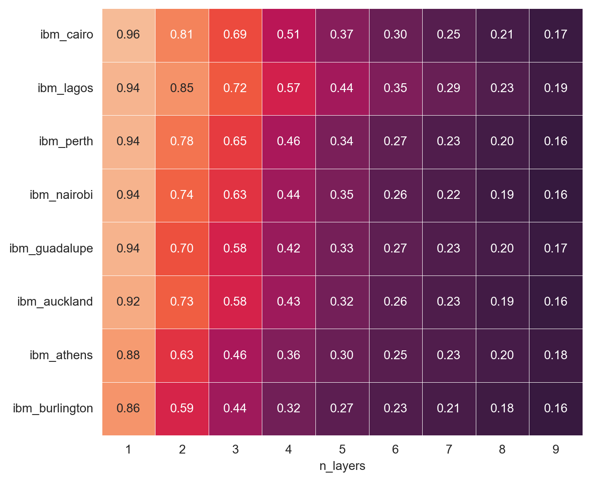
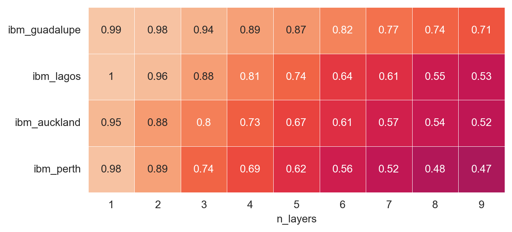
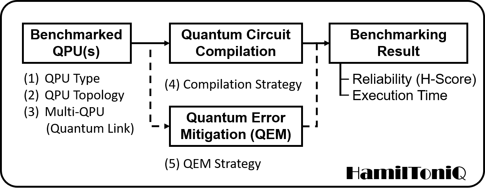
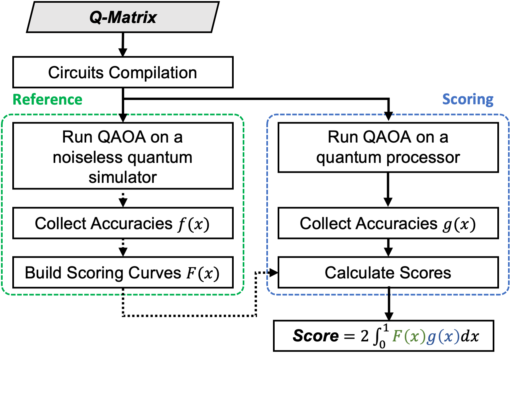

[](https://opensource.org/licenses/MIT) [](https://doi.org/10.48550/arXiv.2404.13971)

# HamilToniQ: An Open-Source Benchmark Toolkit for Quantum Computers

Table of Contents:

1. [Introduction](#introduction)
2. [Quick Start](#quickstart)
3. [H-Scores](#hscores)
4. [Architecture](#architecture)
5. [How to cite](#cite)

<a name="introduction"></a>

## Introduction 

HamilToniQ is an application-oriented benchmarking toolkit for the comprehensive evaluation of QPUs. 

Highlighted features include:

- Easy to use: Users only need to call QPUs, run the main function, and get the scores.
- Comprehensive scoring system: The toolkit generates a single score, termed H-Score, capturing all relevant QPU performance factors such as error rates, circuit compilation, and quantum error mitigation.
- Standardized and comparable results: H-Scores ensure consistent and comparable evaluation across different platforms.
- Focusing on real-world application: The toolkit is based on optimization algorithms to reflect actual application scenarios.
- Multi-QPU support: Utility in multi-QPU resource management has been demonstrated.

<a name="quickstart"></a>

## Quick Start 

### Installation

Install the *HamilToniQ* toolkit by running the following code in the Terminal.

```shell
cd /path/to/your/directory
git clone https://github.com/FelixXu35/hamiltoniq.git
cd hamiltoniq
pip install -e .
```

### Bechmark a backend

Simply copy and run the following Python code:

```python
from hamiltoniq.bechmark import Toniq

toniq = Toniq()
backend = <your_backend>
n_qubits = <your_prefered_number_of_qubits>
n_layers = <your_prefered_number_of_layers>
n_cores = <number_of_cores_in_your_PC>

score = toniq.simulator_run(backend=backend, n_qubits=n_qubits, n_layers=n_layers, n_cores=n_cores)
```

An example is given in [this notebook](./docs/example_code.ipynb).

<a name="hscores"></a>

## H-Scores

The following results were obtained on the built-in Q matrices.

Note that comparison across different numbers of qubits is meaningless.

##### 3 qubits

<p align=center></p>

##### 4 qubits

<p align=center></p>

##### 5 qubits

<p align=center></p>

##### 6 qubits

<p align=center></p>

<a name="architecture"></a>

## Architecture

For more technical details please visit our [arXiv Paper](https://arxiv.org/abs/2404.13971).

The HamilToniQ’s benchmarking workflow, shown in the figure below, commences with the characterization of QPUs, where each QPU is classified according to its type, topology, and multi-QPU system. This initial step ensures a tailored approach to the benchmarking process, considering the unique attributes of each QPU. Subsequently, the process engages in quantum circuit compilation, employing a specific strategy designed to optimize the execution of quantum circuits on the identified QPUs. Integral to the workflow is Quantum Error Mitigation (QEM), which strategically addresses computational noise and errors that could affect the fidelity of the quantum processes. The culmination of this rigorous workflow is the benchmarking result, which quantifies the performance of the QPU in terms of reliability—represented by the H-Score and Execution Time. These metrics provide a quantitative and objective measure of the QPU’s performance, reflecting the effectiveness of the benchmarking process implemented by HamilToniQ. Additionally, the H-score can help manage computational resources in a Quantum-HPC system.

<p align=center></p>

HamilToniQ primarily comprises two components: the reference part, also known as ground truth, and the scoring part, as depicted in the figure below. The reference part, which is optional, utilizes a noiseless simulator to find the scoring curve. Users will only need this part when they are benchmarking on their own Q matrices. In the scoring part, the Quantum Approximate Optimization Algorithm (QAOA) is executed a certain number of times, and the scoring curve is used to determine the score of each iteration based on its accuracy. The final H-Score is computed as the average of all individual scores.

<p align=center></p>

<a name="cite"></a>

## How to cite

If you used this package or framework for your research, please cite:

```text
@article{xu2024hamiltoniq,
  title={HamilToniQ: An Open-Source Benchmark Toolkit for Quantum Computers},
  author={Xu, Xiaotian and Chen, Kuan-Cheng and Wille, Robert},
  journal={arXiv preprint arXiv:2404.13971},
  year={2024}
}
```

