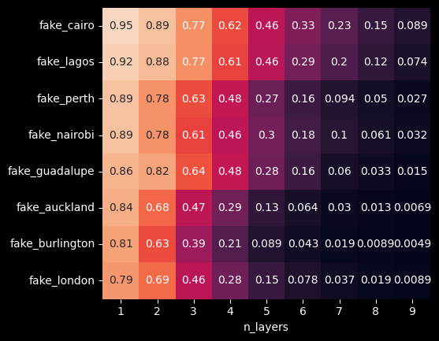
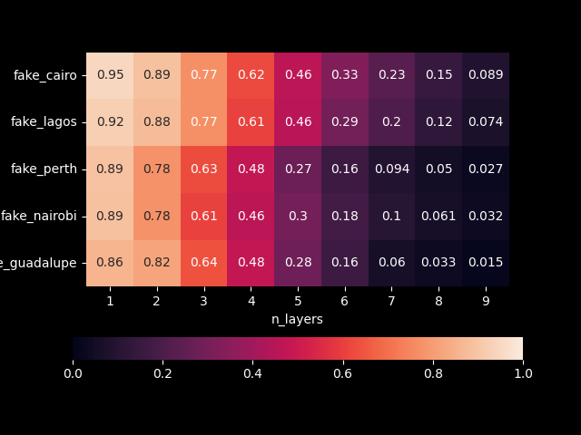

# HamilToniQ

Developed by: Felix Xu, Louis Chen

Table of Contents:

1. [Introduction](#introduction)
2. [Quick Start](#quickstart)
3. [Our Result](#ourresult)
4. [Theory](#theory)

<a name="introduction"></a>

## Introduction 

A benchmarking toolkit designed for QAOA performance on real quantum hardware.

Using HamilToniQ, you can

* benchmark a quantum processor.
* compare the quantum processors and find the one most suitable for your case.

<a name="quickstart"></a>

## Quick Start 

### Installation

Install the *HamilToniQ* toolkit by run the following code in the Terminal.

```shell
cd /path/to/your/directory
git clone https://github.com/FelixXu35/HamilToniQ.git
cd HamilToniQ
pip install -e .
```


### Bechmark a backend

Simply copy and run the following python code:

```python
from HamilToniQ.bechmarking import Toniq

toniq = Toniq()
backend = <your_backend>
dim = <your_prefered_dim>
n_layers = <your_prefered_n_layers>
n_cores = <number_of_cores_in_your_PC>

score = tonic.run(backend=backend, dim=dim, n_layers=n_layers, n_cores=n_cores)
```

<a name="ourresult"></a>

## Our Result 

Since the results depend on the instance/Q matrix used in the benchmarking process, we do not resommand comparing the score across different dimensions.

The following results are sorted by the scores with `n_layers=1`.

##### the number of qubits is 3

<p align=center></p>

##### the number of qubits is 4

<p align=center></p>

<a name="theory"></a>

## Theory 

Our toolkit is rooted in a series of fundamental questions:

Q: What does a user value?

A: Accuracy, which is the possibility of finding the correct answer in one execution of QAOA.

Q: What are the criteria of a good benchmarking tool?

A: Easy to use - use only one number to tell you the overall performance of a backend with a specific number of qubits; Stable - in the benchmarking of with a possibility density distribution, the influence of the variance should be kept to a very low level. 

Therefore, for each backend with a certain number of qubits, our toolkit gives a score, which indicates <u>how much all kinds of noise influence the accuracy</u>. 

Before we dive into the math, I would like to explain what is **overlap distribution**, which is frequently used below. This overlap refers to the overlap between the final state of the QAOA and the expected state (the correct answer). It can also be intepreted as the possibility of finding the correct answer in the final measurement. In the most ideal scenario, the overlaps obtained from multiple execution should be a constant $1$. However, due to the nature of QAOA, even using the noiseless simulator, the overlaps are never a constant, but a distribution. Therefore, we are not going to compare the overlap distribution of a quantum processor with the constant $1$. Instead, a distribution should be compared with the best distribution, which is from a noiseless simulator.

The first step is to build a scoring function $F(x)$. One reference case is solved on a noiseless simulator for $10^4$ times and all overlaps distribution $f(x)$ are interpreted into a histogram with 200 boxes ranging from 0 to 1. The scoring function is the cumulative summation of this 200-element list.

Then we begin to benchmark. The same reference case is solved on a quantum processor for $10^3$ times and each overlap is substituted into the scoring function $F(x)$ for a score. The final score $$s$$ is the average.

In very short, $f(x)$ is the overlap distribution on a noiseless simulator and $F(x)$ is the cumulative summation of it. $g(x)$ is the overlap distribution on a quantum backend. 

Since the reference case is solved for many time, the overlap distribution can be regarded as a continuous function, and the score is represented as an:
$$
s=2\int_0^1F(x)g(x)dx
$$

This score automatically normalises itself. To proof that, simply substute the distribution $f(x)$:
$$
2\int_0^1F(x)f(x)dx = 2\left[F^2(x)\right]^1_0 - 2\int_0^1F(x)f(x)dx \\
\to 2\int_0^1F(x)f(x)dx=1
$$
This property also helps understand the defination of score. If we further consider the noisy quantum processor as lowering each single overlap, the difference $\delta(x)$ between two distribution is then expressed as $g(x) = f(x) + \delta(x)$. $\delta(x)$ is supposed to have the shape as the letter "s" with positive value on the left and negative value on the right. In addition, the integration of this function should be 0.

$$
\int_0^1\delta(x)=0
$$
where 
$$
s=2\int^1_0F(x)f(x)dx+2\int^1_0F(x)\delta(x)dx=1+2\int^1_0F(x)\delta(x)dx
$$
which indicates that this score is based on the "influence" of the noise.

